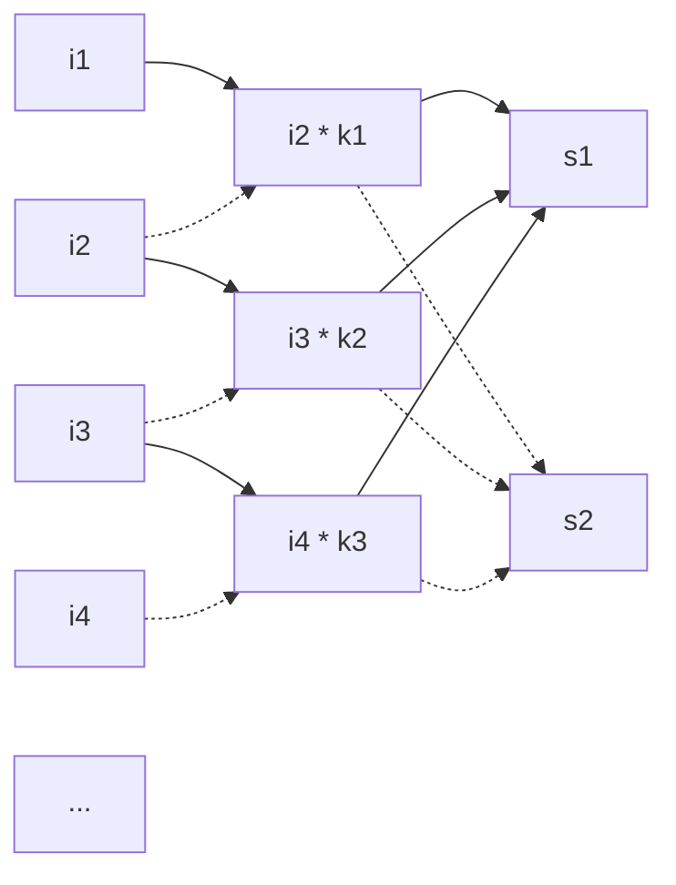

+++
in_search_index = true
title="Pytorch使用"
date=2022-11-22
updated=2023-02-17

[taxonomies]
categories = ["工具使用"]
tags = ["Python","pytorch","深度学习"]
[extra]
toc = true
comments = true 
+++

比较：pytorch和sklearn的比较

1. tf,torch的定位是framework，意思有点类似脚手架。而sklearn的定位则更倾向于工具箱，这种东西拿着就用，入门的门槛相对较低。
2. 应用小量级上用sklearn的还是挺多，但大量级、尤其图形图象、语音视频、nlp等用tf、pytorch的就更多了

# 基础

---

## 常用功能表

| 功能 | 使用 |
| -- | --|
| 输出tensor的形状 | tensor.shape |
| 输出tensor的维度 | tensor.dim() |
| 张量所有元素除以一个数 |torch.div(tensor, val)|

## 常用函数

### view

view()的作用相当于numpy中的reshape，重新定义矩阵的形状。view前后的元素个数要相同。


### arrange
torch.arange(1,10) #产生 1~9 组成的一维张量，第一个值缺省就从0开始

view中一个参数定为-1，代表动态调整这个维度上的元素个数，以保证元素的总数不变。

### transpose

交换输入张量 input 的两个维度

torch.transpose(x, 0, 1) #这就是把x矩阵的0维和1维度交换，即转置

torch.transpose(x, 1, 0) #这个和上面的是一样

torch.transpose(x, -2, -1) #这个将最后一个维度和倒数第二个维度交换，比如有一个张量为[3x4x5]，那么执行转换以后变为[3x5x4]

### squeeze & unsqueeze

**squeeze**:降维，将维度为1的去掉，比如[3x1x4x1x5]执行tensor.squeeze()，变为[3x4x5]

```py
t = torch.full([3,1,4,1,5], 5)
t.squeeze(1) #shape:[3,4,1,5], 同 torch.squeeze(t,1)
```

**unsqueeze**:升维，比如 tensor 为[3x5]， 那么执行 tensor.unsqueeze(0)，变为[1x3x5]

* 也可以用 None 来实现，比如 tensor 为[3x5]，那么tensor[:,None,:,None] 为 [3x1x5x1]
* tensor[...,None] 与 tensor[:,:,None] 同理
* tensor[None]表示在前面加一个维度

### repeat

沿着特定的维度重复这个张量，按照倍数扩充。既可以扩充维度，也可以重复添加元素。从右往左算，从最后的维度到最前的维度算。

* x.repeat(a)
	x = torch.tensor([1,2,3,4])
	x.repeat(3)
	//结果为：[1,2,3,4,1,2,3,4,1,2,3,4]

* x.repeat(a,b)
	x = torch.tensor([1,2,3,4])
	x.repeat(1,3)
	//结果为：[\[ 1,2,3,4,1,2,3,4,1,2,3,4 ]]
	x = torch.tensor([\[1,2,3],[4,5,6]])
	x.repeat(2,3)
	//结果为：size=(4,9)

* x.repeat(a,b,c)
	x = torch.tensor([1,2,3,4])
	x.repeat(1,2,3)
	//结果为：[\[\[ 1,2,3,4,1,2,3,4,1,2,3,4 ],\[ 1,2,3,4,1,2,3,4,1,2,3,4 ]]]

### masked_fill

* mask中为0，则替换为value
	a.masked_fill(mask==0, value=torch.tensor(-1e20))

### expand

对单一维度进行扩展，扩展的维度必须在最前面（第0维）

* -1表示不改变改维度
* 维度为1可以扩展成任意维度，维度不为1则无法扩展

### bmm

计算两个tensor之间乘积的函数，该函数要求两个tensor必须都是三维的，并且要求a，b两个tensor有如下格式：

* a:(b,n,m)

* b:(b,m,p)

* 则result = torch.bmm(a,b)，维度为：（b,n,p）

其实这个三位张量的第一个维度就是batchsize，然后后面量维就是矩阵乘法了。

### softmax

原型：torch.nn.functional.softmax(input, dim=None, _stacklevel=3, dtype=None)

dim参数来指定归一化的维度

* softmax的理解，$s_i = \frac{e^i}{\sum \limits _j^n e^j}$
    
    对于序列[1,2,3,4]， 其softmax为：[0.0321, 0.0871, 0.2369, 0.6439]

    可以知道数字越大，占比越多

### torch.randn

**`torch.randn(5, 3, 10)`**

生成5组3x10个在0-1中符合正态分布的随机数

### contiguous

当调用contiguous()时，会强制拷贝一份tensor(即深拷贝)，让它的布局和从头创建的一模一样，但是两个tensor完全没有联系

### normal

normal(mean, std, *, generator=None, out=None)

torch.normal(mean=0.,std=1.,size=(2,2))  #我们从一个标准正态分布N～(0,1)，提取一个2x2的矩阵

还可以用矩阵。。

使用

[https://zhuanlan.zhihu.com/p/415223758](https://zhuanlan.zhihu.com/p/415223758)

### topk

torch.topk(tensor1, k=3, dim=1, largest=True)

* k #取的元素个数
* dim #选取的维度
* largest #从大到小取元素
* sorted #返回的结果按照顺序返回
* 返回值第一个为结果，第二个为结果的下标

例如：对一个2x3的矩阵

$\begin{bmatrix} 1&2&3 \\ 4&5&6 \end{bmatrix}$

* torch.topk(tenc, k=2, dim = 1, largest = True)
    * 结果矩阵
    $\begin{bmatrix} 3&2 \\ 6&5 \end{bmatrix}$
    * 下标矩阵
    $\begin{bmatrix} 2&1 \\ 2&1 \end{bmatrix}$
    * 相当于每一行取最大的两个值

* torch.topk(tenc, k=1, dim = 0, largest = True)
    * 结果矩阵
    $\begin{bmatrix} 4&6&5 \end{bmatrix}$
    * 下标矩阵
    $\begin{bmatrix} 1&1&1 \end{bmatrix}$
    * 相当于每列取最大的一个值

### einsum

用于处理矩阵求和

例如：C = torch.einsum("ijk->jk", A)
即： $C_{jk}=\sum\limits_i A_{ijk} $

例如：C = torch.einsum("ijm,ijk->jm", A, B)
即： $C_{jm}=\sum\limits_i\sum\limits_k A_{ijm}*B_{ijk} $

公式是知道了，可以这么理解，矩阵的相乘可以表示为：einsum("ab,bc->ac",A,B),即A(a*b),B(b*c)，结果为C(a*c)。以此类推可得此公式表示为张量乘法，不仅可以表示同维度，也可以表示不同维度的乘法。

> https://blog.csdn.net/zhaohongfei_358/article/details/125273126

### sum

对张量的某个维度求和，从结果上来看，就是把对应的维度求和压缩成一个元素，其余结构保持不变。keepdim 则是表示是否保留这个压缩后的维度，相当于对这个维度做 squeeze 操作。

```py
	m = torch.randn([2,5,3]) #shape: [2,5,3]
	m.sum(0) #shape: [5,3]
	m.sum(0, keepdim = Ture) #shape: [1,5,3]
	m.sum(1) #shape: [2,3]
	m.sum(1, keepdim = Ture) #shape: [2,1,3]
```

### stack & cat

两者都是将张量进行拼接，最后输出一个张量

```py
	#---cat---
	#torch.cat(tensors, dim=d, *, out=None)
	#tensors 可以是多个张量
	#除了要进行cat的维度外，其余维度要和待拼接的tensor保持一致
	input = torch.ones(1,2,5)
	input2 = torch.ones(2,2,5)
	output = torch.cat([input2, input,input],0)
	print(output.shape) #shape [4,2,5]

	#---stack---
	#torch.stack(tensors, dim=d, *, out=None)
	#沿新维度连接一系列张量，所有张量都需要具有相同的大小
	input = torch.ones(1,2,5)
	output = torch.stack([input, input,input],0) #在原来的0维前添加
	print(output.shape) #shape: 3,1,2,5
	output = torch.stack([input, input,input],2) #在原来的2维前添加
	print(output.shape) #shape: 1,2,3,5
```

## 常用功能

### 查看可学习参数

在 pytorch 的神经网络种，可学习的参数一般是在线性层 nn.Linear 中的权重和偏置，还有就是使用 nn.Parameter 定义的变量。

torch.nn.Parameter 是继承自 torch.Tensor 的子类，其主要作用是作为 nn.Module 中的可训练参数使用。它与 torch.Tensor 的区别就是 nn.Parameter 会自动被认为是 module 的可训练参数。nn.Parameter 中参数 requires_grad 默认值为 True，表示可训练，False 表示不可训练。

```py
	for name,param in rbf.named_parameters():
		if param.requires_grad:
			print("learned:",name)
```

# 数据处理

---

## 生成数据
* 随机数
	```py
	torch.rand(sizes, out=None) #sizes为张量大小，01均匀分布
	torch.randn(sizes, out=None) #标准正态分布
	torch.randint(low=0, high, sizes, out=None) #区间分布
	```
* 初始数据
	```py
	torch.Tensor(4,3,2) #生成 shape 为 [4,3,2] 的张量，值未经初始化，维度可继续增加
	torch.empty(4,3,2) #生成 shape 为 [4,3,2] 的张量，值未经初始化，维度可继续增加
	torch.zeros(4,3,2, dtype=None) #生成 shape 为 [4,3,2] 的张量，值为 0，维度可继续增加
	torch.ones(4,3,2, dtype=None) #生成 shape 为 [4,3,2] 的张量，值为 1，维度可继续增加
	torch.linspace(start,end,steps=100) #在start到end之间生成均匀分布的steps个数
	torch.eye(n,m=None) #对角线为1，其余为0的矩阵。m默认等于n。
	torch.full(sizes, fill_value) #生成size大小以fill_value填充张量
	```
## Dataset & DataLoader

```py

#Dataset是一个数据处理类。当我们继承了一个 Dataset类之后，我们需要重写 len 方法，getitem 方法

#接收一个索引，返回一个样本，和数组很像
#支持迭代，支持下标索引

from torch.utils.data import Dataset, DataLoader
class MyDataset(Dataset):
    def __init__(self):
        self.x = torch.linspace(1,10,10)
        self.len = len(self.x)

    #获取数据
    def __getitem__(self, index):
        return self.x[index] 

    def __len__(self):
        return self.len

```

```py
#DataLoader
torch.utils.data.DataLoader(
	dataset,  #需要提取数据的数据集，Dataset对象
	batch_size=1,  #每一次装载样本的个数
	shuffle=None,  #进行新一轮epoch时是否要重新洗牌，Boolean型
	sampler=None,
	batch_sampler=None,
	num_workers=0, 	#是否多进程读取机制
	collate_fn=None,
	pin_memory=False,
	drop_last=False, #当样本数不能被batchsize整除时， 是否舍弃最后一批数据
	timeout=0,
	worker_init_fn=None,
	multiprocessing_context=None,
	generator=None,
	*,
	prefetch_factor=2,
	persistent_workers=False,
	pin_memory_device='') 
```
```python
class MyDataset(Dataset):
    def __init__(self):
        self.x = torch.linspace(11,20,10)
        self.y = torch.linspace(1,10,10)
        self.len = len(self.x)

    #获取数据
    def __getitem__(self, index):
        return self.x[index], self.y[index]

    def __len__(self):
        return self.len

mydataset = MyDataset()

mytrainload = DataLoader(dataset=mydataset,
		batch_size = 5,     #mydataset长度为：10/5
		shuffle=False)

#遍历数据集
for step,(batch_x, batch_y) in enumerate(mytrainload):
	print('step:', step,'| batch x: ', batch_x.numpy(), '| batch y: ', batch_y.numpy())
#输出数据
#step: 0 | batch x: [11. 12. 13. 14. 15.] | batch y: [1. 2. 3. 4. 5.]
#step: 1 | batch x: [16. 17. 18. 19. 20.] | batch y: [6. 7. 8. 9. 10.]	
```

# 网络模型

---

## nn.Module 

pytorch里面一切自定义操作基本上都是继承nn.Module类来实现的，我们在定义自已的网络的时候，需要继承nn.Module类，并重新实现构造函数__init__构造函数和forward这两个方法。

1. 一般把网络中具有可学习参数的层（如全连接层、卷积层等）放在构造函数__init__()中，当然我也可以把不具有参数的层也放在里面。

2. 一般把不具有可学习参数的层(如ReLU、dropout、BatchNormanation层)可放在构造函数中，也可不放在构造函数中，如果不放在构造函数__init__里面，则在forward方法里面可以使用nn.functional来代替。

3. forward方法是必须要重写的，它是实现模型的功能，实现各个层之间的连接关系的核心。

4. forward 中的参数怎么理解？x是一个参数列表？

一个普通的结构：将所有的层都放在了构造函数__init__里面，但是只是定义了一系列的层，各个层之间到底是什么连接关系并没有，而是在forward里面实现所有层的连接关系，如[参考](#jump)

torch里面实现神经网络有两种方式

1. 高层API方法：使用torch.nn.****来实现；

2. 层API方法：使用低层函数方法，torch.nn.functional.****来实现；

> <span id="jump">https://zhuanlan.zhihu.com/p/282863934 </span>

## nn.Linear

原型：
torch.nn.Linear(in_features, out_features, bias=True)

* in_features, # 输入的神经元个数
* out_features, # 输出神经元个数
* bias=True # 是否包含偏置

其实就是一个线性变换：$Y_{n\*o} = X_{n\*i}\*W_{i\*o} + b$ ，n 为输入向量的行数

例如：
```python
input = torch.randn(5, 12) #相当于5个样本，每个样本12个特征
fc = nn.Linear(12, 15) #每个向量由12个特征, 输出15个特征
output = fc(input) #输出维度[5*15]
```

### 用于训练参数

一共有四步

1. 准备数据
2. 定义和初始化模型
3. 定义损失和优化算法
4. 训练模型

**一、准备数据**

对于输入的数据（以下为features）一定要做归一化，否会训练出来的loss回变成nan。

```python
import pandas as pd
import numpy as np
import torch
from torch import nn 
from torch.nn import functional as F
import matplotlib.pyplot as plt
import torch.utils.data as Data
import torch.optim as optim
from torch.nn import init

#二元数据
def prepare_data_2d():
	num_inputs = 2
	num_examples = 1000
	true_w = [2, -3.4]
	true_b = 4.2
	features=torch.tensor(np.random.normal(0,1,(num_examples,num_inputs)),dtype=torch.float)
	labels=true_w[0]*features[:,0]+true_w[1]*features[:,1]+true_b
	#加上一些非常小的波动
	labels+=torch.tensor(np.random.normal(0,0.01,size=labels.size()),dtype=torch.float)
	plt.plot(labels)
	plt.show()

	batch_size = 10
	dataset = Data.TensorDataset(features, labels)
	data_iter = Data.DataLoader(dataset, batch_size)
	for X,y in data_iter:
		print(X,y)
		break

#一元数据,便于展示
def prepare_data():
	num_inputs = 1
	num_examples = 1000
	true_w = 2
	true_b = 4.2
    #普通的线性函数：w*x + b
	features=torch.tensor(np.linspace(1, num_examples,num_examples),dtype=torch.float)
	labels=true_w*features[:]+true_b
	#加上一些非常小的波动
	labels+=torch.tensor(np.random.normal(0,1,size=labels.size()),dtype=torch.float)
	plt.plot(labels)
	plt.show()

	batch_size = 10
	dataset = Data.TensorDataset(features, labels) #特征和标签对应，即输入和输出
	data_iter = Data.DataLoader(dataset, batch_size)
	for X,y in data_iter:
		print(X,y)
		break
```

**二、定义和初始化模型**

```python
class LinearNet(nn.Module):
    def __init__(self,n_feature):
        super(LinearNet,self).__init__() 
        self.linear=nn.Linear(n_feature,1)

    #forward 定义前向传播
    def forward(self,x):
        y=self.linear(x)
        return y

net=LinearNet(num_inputs) 
init.normal_(net.linear.weight,mean=0,std=0.01)  
init.constant_(net.linear.bias,val=0) #同：net.linear.bias.data.fill_(0)
#这里的net.linear指的是我们在LinearNet里面定义的，有些人会用net[0]
#查看网络结构
print(net)
#查看所有可学习的参数
for param in net.parameters():
	print(param)
```

**三、定义损失和优化算法**

torch.optim模块提供了很多常用的优化算法比如SGD、Adam和RMSProp等。

```python
#损失函数
loss=nn.MSELoss()
#优化器
optimizer=optim.SGD(net.parameters(),lr=0.03)
```

**四、训练模型**

```python
#训练模型
for epoch in range(1, num_epochs + 1):
	for X,y in data_iter:
		output = net(X)
		l = loss(output, y.view(-1,1))
		optimizer.zero_grad()
		l.backward()
		optimizer.step()
	print('epoch %d, loss: %f'%(epoch, l.item()))
dense=net.linear
print('true_w:',dense.weight)
print('true_b:',dense.bias)
```

> https://zhuanlan.zhihu.com/p/405804117

> https://blog.csdn.net/qq_39033580/article/details/128045951

## nn.LayerNorm

是归一化的一种方法

均值为 0 方差为 1 的标准的正态分布的区间

```py
nn.LayerNorm(normalized_shape, eps=1e-05, elementwise_affine=True, device=None, dtype=None)
```
* 参数：
	* normalized_shape：归一化的维度。如果只有一个值，则只会对最后一维进行归一化，且这个值必须和最后一维的值一样。若是两个值的数组，那么表示最后两个维度。以此类推。
	比如，有shape为[2,3,4]的张量，若normalized_shape 为[4]，则对最后一维做归一化；若normalized_shape为 [3,4]，则对最后两维做归一化。
	
	* eps：加在方差上的数字，避免分母为0

* 比如，输入为(1, 3, 5, 5)的变量，并对其进行LayerNorm（想象有三层，每层是一个5*5的方块）。一般来说有两种归一化的方式, 如下，第一种归一化方法，对所有channel所有像素计算；第二种归一化方法，对所有channel的每个像素分别计算。

<center class="half">
	
</center>

1. 计算所有值的均值和方差，然后归一化
```py
	arr = np.arange(0,3*5*5).reshape(3,5,5)
	arr = arr.astype(np.float32)
	arr = torch.tensor(arr)
	arr = arr.unsqueeze(0)
	print(arr.shape)# shape: [1,3,5,5]
	norm = nn.LayerNorm([3,5,5])
	res = norm(arr)
	print(res.shape) #shape: [1,3,5,5]
```
2.计算每个channel中的参数的均值和方差，然后归一化
```py
	arr = np.arange(0,3*5*5).reshape(3,5,5)
	arr = arr.astype(np.float32)
	arr = torch.tensor(arr)
	arr = arr.unsqueeze(0)
	print(arr.shape)# shape: [1,3,5,5]
	arr = arr.permute(0,2,3,1).contiguous()
	norm = nn.LayerNorm(3)
	res = norm(arr)
	print(res.shape) #shape: [1,5,5,3]
	res = res.permute(0,3,1,2)
	print(res)
```

> https://blog.csdn.net/weixin_41978699/article/details/122778085

## nn.Embedding

```py
nn.Embedding(num_embeddings-词典长度，embedding_dim-向量维度)
```
表示输入的单词个数范围是在num_embeddings中（最多有这么多种单词），embedding_dim表示每个单词的向量长度。
	
* 比如：

embedding = nn.Embedding(10,3)
	
input = tensor.LongTensor([\[1,2,3,4],[5,6,7,8]]) 

embedding(input) #shape: [2,4,3]

## nn.Conv1d

```py
torch.nn.Conv1d(in_channels,       "输入的通道数"
                out_channels,      "卷积产生的通道数"
                kernel_size,       "卷积核的大小"
                stride,            "卷积的步幅。默认值：1"
                padding,           "添加到输入两侧的填充。默认值：0"
                dilation,          "内核元素之间的间距。默认值：1"
                groups,            "从输入通道到输出通道的阻塞连接数。默认值：1"
                bias,              "If True，向输出添加可学习的偏差。默认：True"
                padding_mode       "'zeros', 'reflect', 'replicate' 或 'circular'. 默认：'zeros'"
                )
```

卷积后的维度：(n - k + 2 * p ) / s + 1 
(k: 卷积核大小，p: 使用边界填充，s: 步长。)

每个卷积核与输入元素做乘积，然后计算和得到一个结果。见参考。


```py
import torch
import torch.nn as nn
input = torch.randn(1, 1, 5) #shape: [批大小， 数据的通道数， 数据长度]
conv = nn.Conv1d(in_channels=1, out_channels=1, kernel_size=3, stride=1, padding=0)
out = conv(input)
```

总的来说，这就是一个实现 MLP 结构的另一种方法

> https://blog.csdn.net/xu624735206/article/details/124961990

## nn.Conv2d

nn.Conv2d(in_channels=3,out_channels=64,kernel_size=4,stride=2,padding=1)

> 参考：[https://blog.csdn.net/weixin_38481963/article/details/109924004](https://blog.csdn.net/weixin_38481963/article/details/109924004)

## nn.Sequential

一个序列容器，用于搭建神经网络的模块被按照被传入构造器的顺序添加到nn.Sequential()容器中。除此之外，一个包含神经网络模块的OrderedDict也可以被传入nn.Sequential()容器中。

利用nn.Sequential()搭建好模型架构，模型前向传播时调用forward()方法，模型接收的输入首先被传入nn.Sequential()包含的第一个网络模块中。然后，第一个网络模块的输出传入第二个网络模块作为输入，按照顺序依次计算并传播，直到nn.Sequential()里的最后一个模块输出结果。

> 参考：[https://blog.csdn.net/Just_do_myself/article/details/124195393](https://blog.csdn.net/Just_do_myself/article/details/124195393)
> 

## nn.Dropout

为了防止过拟合
* nn.Dropout(p = 0.3) # 表示每个神经元有0.3的可能性不被激活
* Dropout只能用在训练部分而不能用在测试部分
* Dropout一般用在全连接神经网络映射层之后，如代码的nn.Linear之后

```py
class Dropout(nn.Module):
	def __init__(self):
		super(Dropout, self).__init__()
		self.linear = nn.Linear(5,10)
		self.dropout = nn.Dropout(p=0.3)
	def forward(self, inputs):
		out = self.linear(inputs)
		out = self.dropout(out) #这里让上一层输出的30%的数据变为0
		return out

def run():
	net = Dropout()
	inputs = np.arange(0,5)
	inputs = torch.tensor(inputs, dtype=torch.float)
	inputs = inputs.repeat(1,1)

	print(inputs.shape)
	print(net(inputs))
```


> https://blog.csdn.net/weixin_47050107/article/details/122722516
## nn.RNN

```py
#参数解释
#初始化
nn.RNN(
	input_size,  #输入的特征数
	hidden_size, #隐层维度
	num_layers = 1,  #层数
	batch_first = False, #把batch放在第一维度，即[batch, seq, feature]
	nolinearity = 'tanh,
	bias = 'True,
	dropout = 0,
	bidirectional = False,
)

#训练输入
def forward(self, x)
{}
# x 的 shape
# 1、对于没有batch，[seq_len, input_size]
# 2、对于 batch_first = False，[seq_len, batch_size, input_size]
# 3、对于 batch_first = True，[batch_size, seq_len, input_size]

#训练输出 shape
# 这里 d 是双向(是：2,否：1)
# 1、对于没有batch，[seq_len, d*hidden_size]
# 2、对于 batch_first = False，[seq_len, batch_size, d*hidden_size]
# 3、对于 batch_first = True，[batch_size, seq_len, d*hidden_size]
# 这里的 hidden_size 是隐层数量
```

* 在单特征预测的情况下，一般会将前面 k 个样本数据作为输入的特征，预测 k+1 的值。
* 在多特征预测的情况下，会使用每个样本的特征，一步步做预测。
